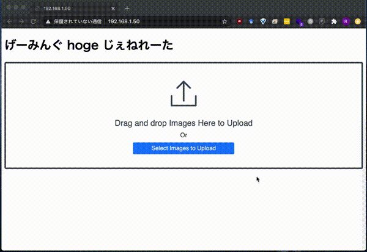

# gaming-hoge-generator


## Slides
https://docs.google.com/presentation/d/1RDkNOUKaD20xB4eddGv-fGaYhjH8RDHr65p3Q3kDadQ/edit?usp=sharing

## Requirements
- Python 3.7
- TensorFlow GPU 1.14
- Keras 2.3.1

# Quick Start
[Docker](https://docs.docker.com/get-docker/) and [docker-compose](https://docs.docker.com/compose/install/) are needed here.
If you don't have them, install them or go to [Manual Setup](#Manual-Setup).

After you clone this repository,
```bash
# initialize the submodule
git submodule update --init --recursive
# run backend and frontend application
docker-compose up -d
```

And you can see this application on `http://<YOUR IP ADDRESS>:80`

# Run Application on kubernetes
You can deploy application on your kubernetes with next command.

## Requirement
- kubectl

## command
```bash
sudo curl -sf https://raw.githubusercontent.com/RIckyBan/gaming-hoge-generator/master/scripts/k8s-deploy.sh | sh -s
```

# Manual Setup

## Initialize the submodule
```bash
git submodule update --init --recursive
```

## Create virtual env (conda)

```bash
conda create -n gaming_hoge python=3.7
source activate gaming_hoge
conda install -c anaconda tensorflow-gpu=1.14 flask flask-cors pillow scikit-image
conda install -c conda-forge pycocotools imgaug keras=2.3.1
pip install opencv-contrib-python
```
## Run backend application

```bash
# Mask_RCNN setup
cd backend/Mask_RCNN
python3 setup.py install
# Download weights
wget https://github.com/matterport/Mask_RCNN/releases/download/v2.0/mask_rcnn_coco.h5

# Run a backend application in the background (Port 5000 is used)
cd ../
nohup python3 app.py &
```

## Run web client
Set your ip in `frontend/nginx/conf.d/default.conf`.

```
location ~ /server {
        proxy_pass http://<YOUR IP ADDRESS>:5000;
        proxy_read_timeout 10m;
        proxy_connect_timeout 10m;
        client_max_body_size 10M;
}
```

Then, start nginx server. (Docker is used here, but you can run web client in your nginx server).

```bash
cd frontend

# build nginx docker image
sudo docker build -f nginx/Dockerfile -t frontend .

# run a container
sudo docker run -d --name frontend -p 80:80 frontend
```

And you can see this application on `http://<YOUR IP ADDRESS>:80`

Note:
Images you share to Imgur are publicly visible to everyone. Please be careful.